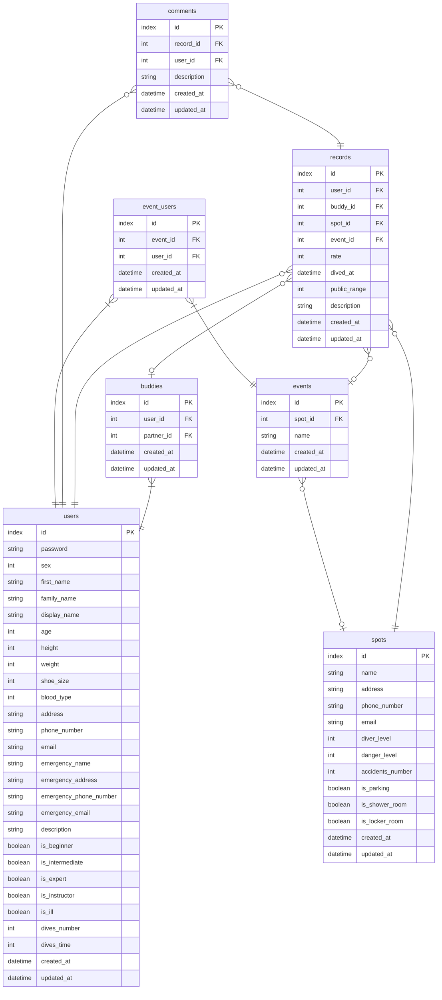

```mermaid

erDiagram

  buddies}|--||users : ""
  records}o--||users : ""
  records}o--o|buddies : ""
  records}o--||spots : ""
  records}o--o|events : ""
  comments}o--||records : ""
  comments}o--||users : ""
  events}o--o|spots : ""
  event_users}|--||events : ""
  event_users}|--||users : ""

  users {
    index id PK
    string password
    int sex
    string first_name
    string family_name
    string display_name
    int age
    int height
    int weight
    int shoe_size
    int blood_type
    string address
    string phone_number
    string email
    string emergency_name
    string emergency_address
    string emergency_phone_number
    string emergency_email
    string description
    boolean is_beginner
    boolean is_intermediate
    boolean is_expert
    boolean is_instructor
    boolean is_ill
    int dives_number
    int dives_time
    datetime created_at
    datetime updated_at
  }

  buddies {
    index id PK
    int user_id FK
    int partner_id FK
    datetime created_at
    datetime updated_at
  }

  records {
    index id PK
    int user_id FK
    int buddy_id FK
    int spot_id FK
    int event_id FK
    int rate
    datetime dived_at
    int public_range
    string description
    datetime created_at
    datetime updated_at
  }

  comments {
    index id PK
    int record_id FK
    int user_id FK
    string description
    datetime created_at
    datetime updated_at
  }

  spots {
    index id PK
    string name
    string address
    string phone_number
    string email
    int diver_level
    int danger_level
    int accidents_number
    boolean is_parking
    boolean is_shower_room
    boolean is_locker_room
    datetime created_at
    datetime updated_at
  }

  events {
    index id PK
    int spot_id FK
    string name
    datetime created_at
    datetime updated_at
  }

  event_users {
    index id PK
    int event_id FK
    int user_id FK
    datetime created_at
    datetime updated_at
  }

```
